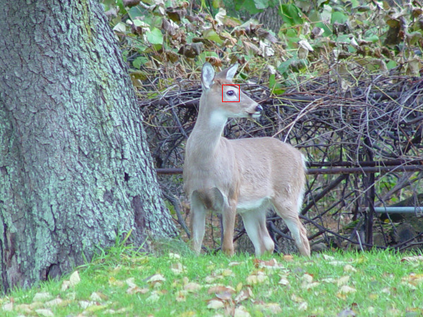
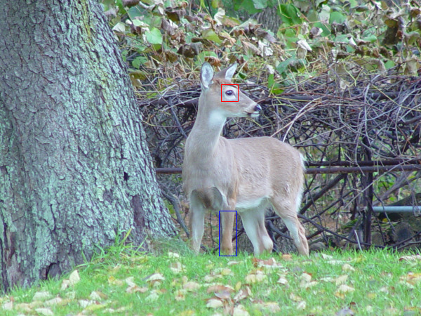
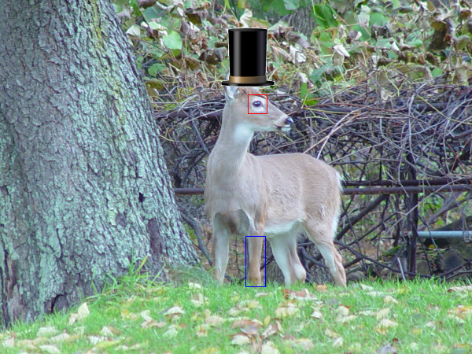
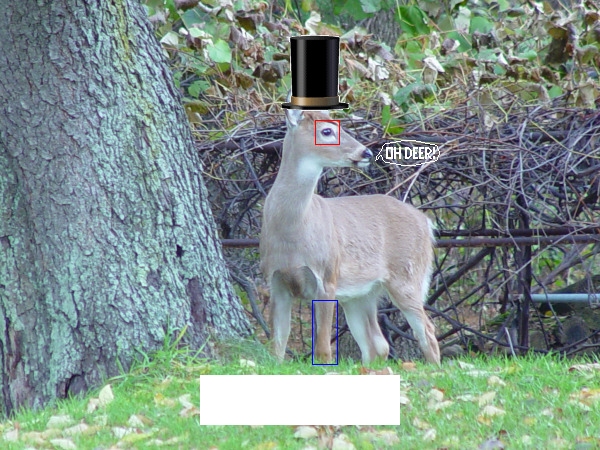

# PPM Image Manipulation Project

## Detailed Description
In the previous project, you developed classes for representing a Color, a Color Image, and a Row/Column Location. This project will use those same concepts but will focus on the use of dynamic allocation of arrays and file input/output, as well as separating your implementation into multiple files. We’ve also talked about detecting and overcoming stream issues, and you’ll be expected to manage that as well.

## Background: .ppm Imagery
<p float="left">






</p>

Since you will be reading and writing images, you need some background on how images work. For this project, we will use a relatively simple image format, called PPM imagery. These images, unlike most other formats, are stored in an ASCII text file, which you are already familiar with. More complicated image formats (like .gif and .jpg) are stored in a binary file and use sophisticated compression algorithms to make the file size smaller. A .ppm image can contain the exact same image as a .gif or .jpg, but it would likely be significantly larger in file size. Since you already know how to read and write text files, the only additional information you need is the format of the .ppm file.

Most image types start with two special characters, which are referred to as that image type's "magic number" (not to be confused with the magic numbers we’ve talked about as being bad style in programming). A computer program can determine which type of image it is based on the value of these first two characters. For a .ppm image, the magic number is "P3", which simply allows an image viewing program to determine that this file is a PPM image and should be read using the PPM format. If a file doesn’t start with the very specific magic number “P3”, it is to be considered an invalid PPM file.

Since a 100 pixel image may be an image of 25 rows and 4 columns, or 10 rows and 10 columns (or any other such combination) you need to know the specific size of the image. Therefore, after the magic number, the next two elements of the PPM file are the width of the image, followed by the height of the image. Obviously, both of these values should be integers, since they both are in units of "number of pixels". (Note: width comes first, and height comes second! People always get this mixed up, so take care with the order…)

The next value is also an integer, and is simply the maximum value in the color descriptions. For this project, you will use 255 as the maximum number. With a maximum of 10, you are only allowed 10 shades of gray, and 10^3 unique colors which would not allow you to generate a very photographic-looking image. But if your maximum value is 255, you could get a much wider range of colors (255^3). For this project, a value of 255 is the only valid “maximum color value” allowed, and any value that is NOT 255 will be considered an “invalid PPM image” and should be reported as an error.

The only thing left is a description of each and every pixel in the image. The pixel in the upper left corner of the image comes first. The rest of the first row follows, and then the first pixel of the second row comes after that. This pattern continues until every pixel has been described (in other words, there should be rows*cols color values in the PPM file). As mentioned above, each pixel is described with three integers (red, green, blue), so a 4 row by 4 column color image requires 4*4*3=48 integers to describe the pixels.

A very small image of a red square on a blue background would be stored in a PPM file as follows:<br />
P3 <br />
4 4 <br />
255 <br />
0 0 255   0 0 255   0 0 255   0 0 255 <br />
0 0 255   255 0 0   255 0 0   0 0 255 <br />
0 0 255   255 0 0   255 0 0   0 0 255 <br />
0 0 255   0 0 255   0 0 255   0 0 255 <br />

Please note that I have provided this example in a nicely formatted way for ease of understanding, but a PPM file is not required to be “line-based”. In other words, there is nothing in the PPM format that requires one row of pixels to be contained on a single line, or that pixel values are separated with more spaces than the RGB values, etc.

### File Naming For PPM Images
Most often, PPM files will end with a “.ppm” extension. However, this is not a requirement, and your program should not perform any checking for a specific filename extension. While it might be very confusing, there could be a file named “definitelyNotAPPM.exe” with contents that were a valid PPM – if we were to provide such a file to your implementation, you should read the contents of the file just as if it were named “myPPM.ppm”. Typically, file extensions are used as a convention for general understanding of what a file contains, but (especially in Linux) this is strictly a convention as opposed to a requirement.

## Required Functionality
For this project, you are only required to implement a few algorithms to modify an image. However, after completing the project, you will be able to add any number of your own algorithms to modify imagery in any number of ways. Below are the descriptions of the algorithms you are required to implement:

### 1. Rectangle Drawing
You will need to allow rectangles to be drawn on an image. Rectangle outlines may be placed on an image to draw attention to a specific area, or filled rectangles may be placed on an image to block out a specific area. Both of these operations will be supported in this project.

### 2. Pattern Annotation
An image may be annotated with a “pattern”. A pattern, while rectangular overall, contains a description of a shape that is to be placed on an image. A pattern consists of a rectangle of only zeros and ones. When a pattern is placed over an image, values in the pattern will likely fall over a specific pixel in the original image. A value of one in a pattern indicates that the pixel under it should be modified to a certain color that is specified by the user. A zero in a pattern indicates that the pixel under it should NOT be affected by the pattern. Its original value is left intact, resulting in a sort of transparency.

### 3. Image Insertion
The final image modification algorithm you will implement is the insertion of another (presumably smaller) PPM image at a specified location within the image being modified. This insertion simply reads another PPM image from a file and inserts the image contents where the user desires. PPM images are, by definition, rectangular. Since oftentimes the image you want to insert is not rectangular, you must support a transparency color, such that any pixel in the image to be inserted which is the transparency color does not change the original image, but pixels that are not the transparency color will be used to replace the pixel value in the original image.

### 4. Output to PPM File
At any stage, you must allow the user to output a PPM image file in its current state from the main menu. The user may want to output an image after each change made, or just once when all updates have been performed.

## Out of Bounds Patterns and Inserted Images
When inserting a pattern or image, it is possible that part of the inserted item will extend beyond the bounds of the image being inserted into. This should not be considered an error for this project. The pixels that are within bounds should be inserted as usual, and the ones that are out of bounds should just not have any effect. This approach allows a user to purposely insert a pattern or image at a location that will result in only part of the inserted item being included.

## Implementation and Design
All of your global constants must be declared and initialized in a file named `constants.h`. This file will not have a corresponding `.cpp` file, since it will not contain any functions or class definitions. Make sure you put all your global constants in this file, and avoid magic numbers.

The image pixels will be allocated using the `new` operator, using exactly the amount of space required for the image (for example, a smaller image will use less memory than a larger image). Therefore, there is no practical limit to the size of the image allowed.

Each individual class will be contained in a `.h` and a `.cpp` file (named with the class name before the dot). All class member variables must be private, and your member functions may be public.

## Files Included
- `constants.h` – Contains global constants.
- `ColorClass.h`, `ColorClass.cpp` – Represents color information for each pixel.
- `ColorImageClass.h`, `ColorImageClass.cpp` – Contains logic for managing an image.
- `RowColumnClass.h`, `RowColumnClass.cpp` – Manages row and column data.
- Additional utility and test files.

## Rectangle Input Methods

In this project, the user can specify a rectangle in three different ways. These methods allow flexibility in how rectangles are described but are internally stored in a consistent format. The three input methods are:

1. **Upper-left and Lower-right Corners**: 
   - The user specifies the upper-left corner and the lower-right corner directly by providing the coordinates of both points.
   
2. **Upper-left Corner, Width, and Height**: 
   - The user provides the coordinates of the upper-left corner and the dimensions (width and height) of the rectangle. The lower-right corner is computed internally by adding the width to the x-coordinate and the height to the y-coordinate.
   
3. **Center, Half-width, and Half-height**: 
   - The user specifies the center of the rectangle and its half-width and half-height (i.e., the extents from the center). The program internally calculates the upper-left and lower-right corners by using the center coordinates and the extents.

### Internal Representation of Rectangles

Regardless of the input method chosen by the user, **all rectangles are represented internally by two points: the upper-left corner and the lower-right corner**. This simplifies the design and ensures that all operations (such as drawing the rectangle) are performed in a consistent way.

The conversion logic for each input method is as follows:

- **Method 1 (Upper-left and Lower-right Corners)**: These values are used directly as the internal representation of the rectangle.
- **Method 2 (Upper-left Corner and Width/Height)**: The lower-right corner is calculated by adding the width to the x-coordinate and the height to the y-coordinate of the upper-left corner.
- **Method 3 (Center and Half-width/Height)**: The upper-left corner is calculated by subtracting half the width from the center's x-coordinate and half the height from the center's y-coordinate. The lower-right corner is calculated by adding these values.

### Design Philosophy

The design of the rectangle handling is focused on **simplicity and flexibility**. Instead of storing separate attributes for each method of input, the program stores only the upper-left and lower-right corners. This eliminates redundancy and ensures the code is easier to maintain and extend in the future.

### User Interface

The program uses a menu-driven interface where the user can choose from the following options:
- Insert a rectangle
- Insert a pattern
- Insert an image
- Save the image
- Exit the program

The program will guide the user through the necessary inputs for each action. 

**Important Note**: The program **must** follow the exact sequence of actions and user input prompts as specified in the sample output. Do not reorder menu options, add extra prompts, or change the required user inputs. The program must behave consistently with the expected flow and format.

---

## Example Usage

### Compilation
```bash
make
./proj3.exe
```

## Project Structure

```bash
.
├── src/
│   ├── ColorClass.cpp
│   ├── ColorClass.h
│   ├── ColorImageClass.cpp
│   ├── ColorImageClass.h
│   ├── RowColumnClass.cpp
│   ├── RowColumnClass.h
│   ├── main.cpp
│   └── Makefile
├── Inputs/
│   ├── deer.ppm
│   ├── ohdeerPattern.txt
│   └── topHat.ppm
├── Outputs/
│   ├── new1.ppm
│   ├── new2.ppm
│   ├── new3.ppm
│   ├── new4.ppm
│   └── new5.ppm
└── README.md
